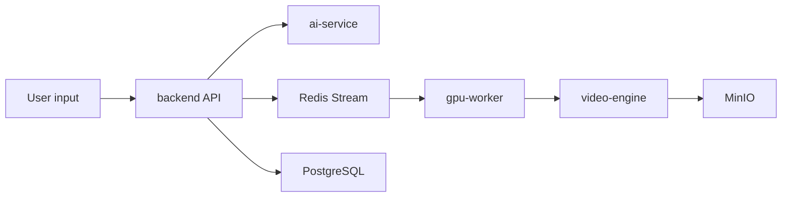

# Architecture

## Phase 1 Flow

## Service Responsibilities

| Service | Responsibility |
| --- | --- |
| backend | API, auth, task lifecycle, orchestration, persistence |
| ai-service | script generation, storyboard generation, knowledge retrieval |
| video-engine | FFmpeg render planning, subtitles, BGM, export |
| gpu-worker | digital human inference, voice/lip-sync, retryable GPU jobs |
| storage | object storage for input assets and generated videos |

## Key Boundaries

- The backend should not contain model inference or FFmpeg implementation details.
- AI services should expose typed HTTP contracts before model integration.
- Video rendering should be queue-driven once persistence is added.
- Every task log should include `request_id`, `user_id`, and `task_id` when available.

